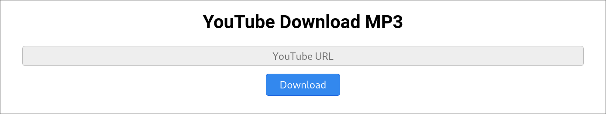

# YT DL Web

This is a simple website to download audio (as `.m4a`) from YouTube using [yt-dlp](https://github.com/yt-dlp/yt-dlp).

Here's a screenshot of the website:



## Running Locally

With Golang installed, just run
```bash
go run main.go
```

This will start a web server at `http://localhost:3333`


## Building Docker Container

To build the Docker container, you first need to build the Golang server:
```bash
go build main.go
```

Then you can build the container:
```bash
docker buildx build -t <tag> .
```

This will build a docker image with yt-dlp pre-installed, so you can run it anywhere
